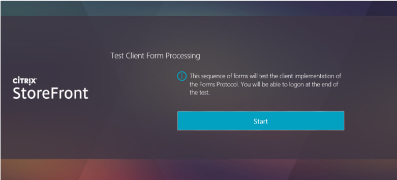
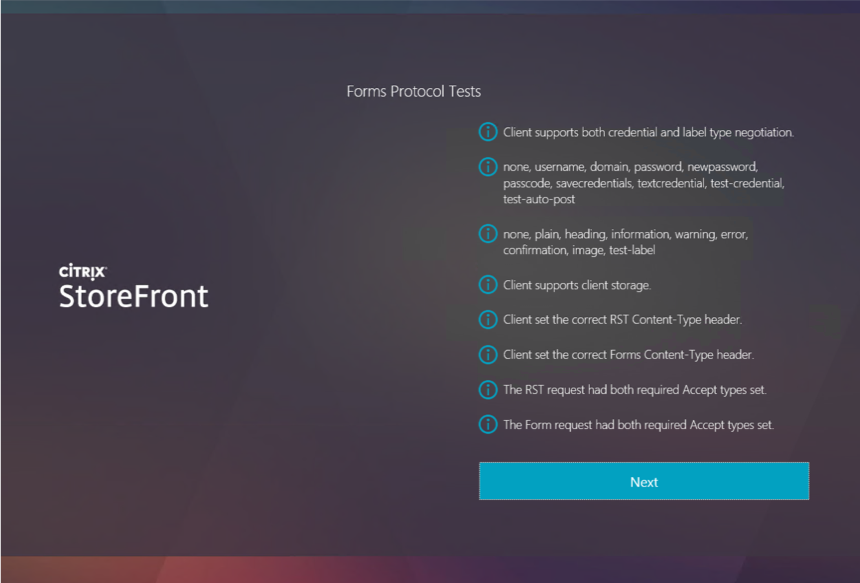
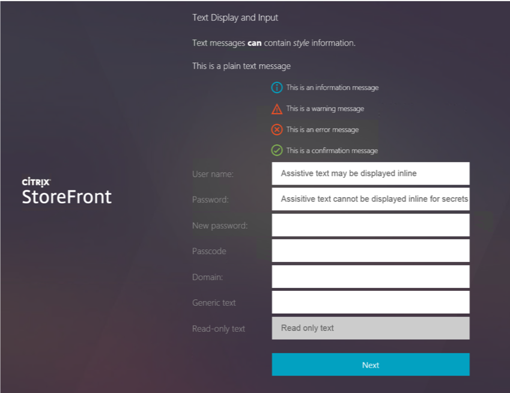
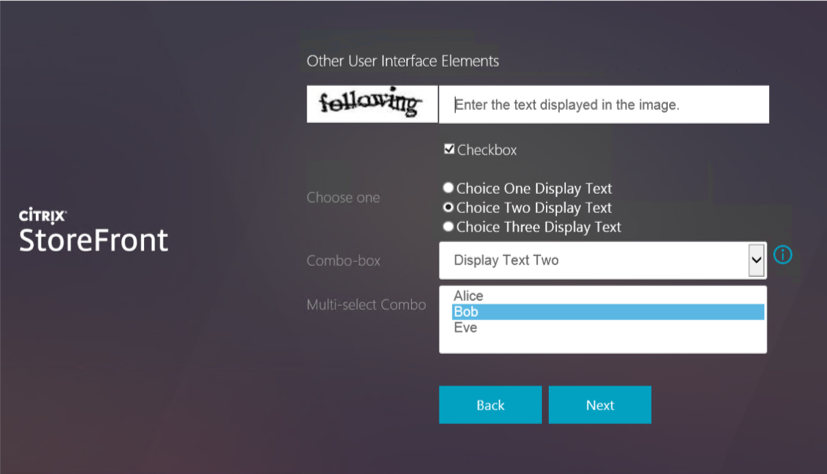
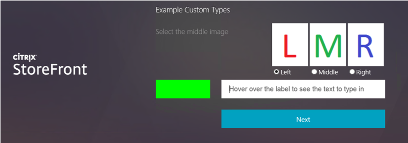
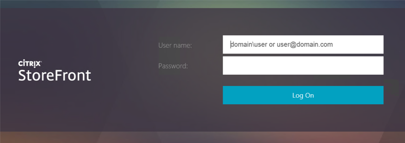
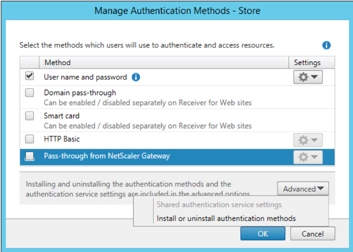
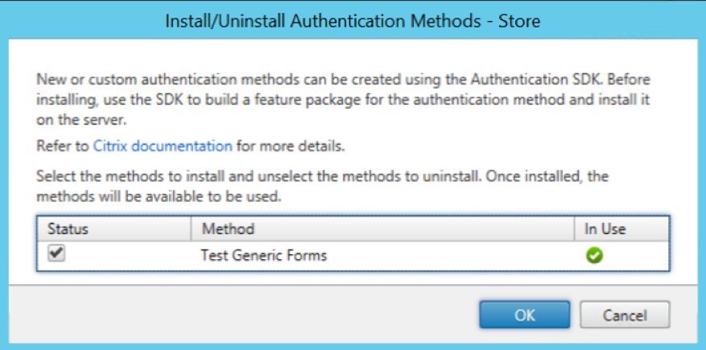
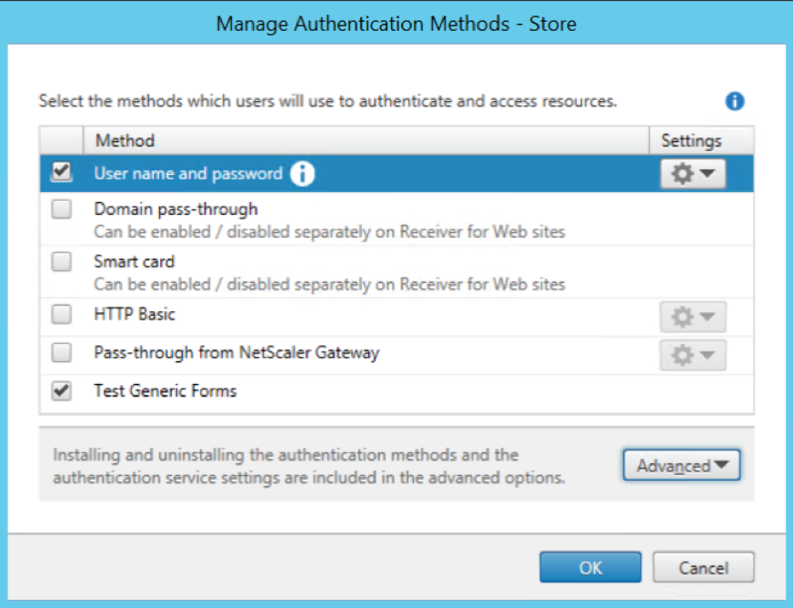

#Sample: Test Forms

# Overview

### Introduction

This sample for the StoreFront Authentication SDK demonstrates how to create and add a custom form implementation to StoreFront. As described in the StoreFront Services Authentication SDK document, this protocol will be advertised to the clients as: CustomForms. The clients are required to recognize this protocol identifier and map it to their existing Common Forms rendering. Clients will give preference to this new protocol over the existing ExplicitForms protocol, should both be available.
Note: Only one authentication method can be deployed that advertises itself with a specific protocol choice name. As Forms customizations rely on being advertised as CustomForms, this means that only one Forms customization can be installed on a StoreFront server.

### User Experience

Test Forms is a simple implementation of the Forms Protocol that runs through a sequence of pre-configured forms to demonstrate all the User Interface Widgets that are currently part of the Common Forms Language. There is no processing of the returned forms data, in most of the forms: the next form is just displayed.
This sample also demonstrates how to add new credential and label types, as described in the Citrix Common Authentication Forms Language v3.6 document, and how to use the Receiver for Web JavaScript API described in the StoreFront Authentication SDK JavaScript API document.

At the end of the test forms, the user is offered the chance to log on using the built-in user name and password form. The following shows how the sequence of forms is displayed in Receiver for Web:

First an information message is displayed:



Next a series of tests are done and the results displayed:



The next form demonstrates display and input of textual data:



This is followed by a form illustrating the other user interface elements:



If the administrator has deployed the JavaScript plug-in, then the following two forms are displayed, if not then they will be skipped.

The first form illustrates the use of a custom label type, which displays text for the user to type, when the cursor is over the label. It also demonstrates a custom credential type, in this case the user has to select a specified image.

**Note**: Both of these fields are validated and the user must supply the correct data to proceed, so the sample also demonstrates how to display context error messages.



The second form demonstrates how to create a form that requires no interaction from the user. The JavaScript just auto-posts the credential value back to the server, in this case the User-Agent. A form is then displayed that shows the value of the credential posted to the server.



Finally the user is offered the chance to log on using the built-in user name and password form:


If the configuration has been updated to allow the user to change their expired password, and the user’s password has expired, then the change password mini-conversation begins.

When the user has successfully entered their credentials, they are granted access to the system.

### Administrator Experience

If the Test Forms sample is installed after a store has been created it will not automatically appear in the list of authentication methods for a store, when the “Manage Authentication Methods” action is selected.



However, if the Test forms sample is installed before a Store is created, then it will automatically appear with the other authentication methods.

Selecting “Install or uninstall authentication methods” from the Advanced options, allows the newly installed Test Forms sample to be deployed, by selecting the “Status” checkbox.



Once the Test Forms sample has been deployed, it can then be managed using the same “Manage Authentication Methods” action as for the other authentication methods.



To remove the authentication customization, prior to uninstalling it, again use the “Install or uninstall authentication methods” from the Advanced options of the “Manage Authentication Methods” dialog. Unchecking the “Status” checkbox will remove the authentication method.

#### PowerShell

The feature can also be managed through PowerShell, after first adding all the StoreFront PowerShell modules:

```
Get-Module "Citrix.StoreFront.*" -ListAvailable | Import-Module
```
First the Test Forms StoreFront feature must be added:

```
Install-STFFeature -PackageName "TestForms"
```

The Authentication Service to which the Feature will be added must then be found. This can be done either from the associated store, in this example, the store is named: “Store”, and is located at virtual path: /Citrix/Store:

```
$StoreVirtualPath = "/Citrix/Store"
$store = Get-STFStoreService -VirtualPath $StoreVirtualPath

# Get the Authentication Service from the associated Store 
$authService = Get-STFAuthenticationService -StoreService $store
```

Or by the virtual path of the Authentication Service, in this case: /Citrix/StoreAuth:

```
$authService = Get-STFAuthenticationService -VirtualPath "/Citrix/StoreAuth"
```

Once the Authentication Service has been located, then the feature must be added, using the associated name of the protocol choice, which in this case is: “CustomForms”:

```
Add-STFAuthenticationServiceProtocol -Name "CustomForms" -AuthenticationService $authService
```

The following will ensure that the Test Forms authentication method is enabled:

```
Enable-STFAuthenticationServiceProtocol -AuthenticationService $authService -Name "CustomForms"
```

The Test Forms feature can be removed from an Authentication Service with the following command:

```
Remove-STFAuthenticationServiceProtocol -Name "CustomForms" -AuthenticationService $authService
```

#### Receiver for Web JavaScript Plug-in

The administrator can manage the Receiver for Web JavaScript plug-in using PowerShell only.

Assuming that the StoreFront modules have been loaded, as shown above, then the Receiver for Web plug-in feature must be first added:

```
Install-STFFeature -PackageName "TestFormsReceiverPlugin"
```

The Receiver for Web site to which the Feature will be added must then be found. This can be done for a specific Receiver for Web site, if its virtual path is known, in this example: /Citrix/StoreWeb

```
$wrSite = Get-STFWebReceiverService -VirtualPath /Citrix/StoreWeb
```

Alternatively, all the Receiver for Web sites for a specified Store can be found, in this example the store is named: “Store” and is located at virtual path /Citrix/Store:

```
$store = Get-STFStoreService -VirtualPath "/Citrix/Store"

# Get the Receiver for Web sites from the associated Store 
[array]$wrSites = Get-STFWebReceiverService -StoreService $store
```

Once a Receiver for Web site has been located, the plug-in can be added:

```
Add-STFWebReceiverFeature -Name "TestFormsReceiverPlugin" -WebReceiverService $wrSite
```
The plug-in can be removed again:

```
Remove-STFWebReceiverFeature –Name "TestFormsReceiverPlugin" –WebReceiverService $wrSite
```

### Installer
In common with the other samples, a pre-built installer is provided in addition to the source code.

Before attempting to deploy the pre-built sample installers, it is required to add the certificate at AuthSDK.zip/Certificates/YourCompany.cer to the Third-Party Root Certification Authorities store of the Local Computer account where StoreFront is installed. This is not required for the development machine. If this step is not completed, then the StoreFront Administration Console will display an error because the digital signature of the PowerShell modules associated with this customization will fail to verify.

The installer verifies that there is not an existing customization that implements CustomForms, before deploying the StoreFront Feature package and the add-ins to the administration console. To actually deploy and enable a sample the “Add/Remove Methods” action from the “Authentication” node of the StoreFront Administration Console should be used.

**Note**: If the installer is being deployed to a StoreFront Server Group, it must be run on all servers in the group.

Before attempting to uninstall a sample, the associated authentication method must first be removed using the “Manage Authentication Methods” action from the “Stores” node of the StoreFront Administration Console, as described above. If this is not done, attempting to uninstall will result in a dialog informing the administrator that the feature should be removed using the StoreFront Administration Console first. The sample can then be removed by using the standard “Add/Remove Programs” control panel applet.

The installer also demonstrates automatically removing the Receiver for Web plug-in from every site where it has been deployed.

## Code Sample
### Visual Studio Solution Layout
This sample demonstrates a subset of the available aspects of the SDK, and is composed of five projects:

* Feature contains the code that will be added to the Authentication Service to control the authentication process, including:
	* A custom conversation object and its associated factory o Custom forms and templates for the individual forms
	* The start-up module used to populate the IoC container
* Console.Extension contains the code for the administration console, including the data models, action handlers, business logic, and user interface elements.
* Installer is a WiX project to create an msi installer to deploy and remove the Test Forms Features. It also contains the StoreFront Feature Package definitions and builds the Feature Package.
* Installer.CustomActions contains the msi custom actions required to deploy and remove the Test Forms Features.
* UnitTests contains some unit tests to verify the merging of the code and configuration into the authentication service,
verify the behavior of the Service Locator, and verify the behavior of the authentication conversation.

This sample does not require any configuration, and so does not contain a configuration project or a StoreFront Administration Console View Extension. It also requires no custom deployment steps or PowerShell commands and so does not have a Feature Installer project.

All the projects target the .NET Framework 4.5 and the MSIL platform, unless specifically stated. Projects that target .NET Framework 3.5 are either part of the StoreFront Administration Console, or loaded by the Console. The rationale behind this is discussed in the StoreFront Services Authentication SDK document.

In addition, the sample contains the code for the Receiver for Web JavaScript plug-in, which can be found in the Receiver directory. This contains a featureTemplate directory that holds the files for adding the plugin registration data into Receiver for Web. The Plugin directory contains the JavaScript and css files required by the plugin.

### Feature Project
This C# class library project contains the custom classes for controlling the forms conversation; see the StoreFront Authentication Form Generation document for more details. These classes include:

* The custom conversation and its associated factory
* Custom forms and templates for the individual forms that comprise the conversation

The project also contains the start-up module that is responsible for populating the IoC container with the objects required for this custom conversation. See the StoreFront Services Authentication SDK document for more details regarding start-up modules. This start-up module adds the conversation factory.

### Console.Extension Project
This C# class library project contains:

* The authentication extension class to provide status messages including one that states that this customization will take precedence over user name and password
* The localizer class to provide the localized authentication method name in the StoreFront Administration Console 

**Note**: This project is targeted at .NET Framework 3.5, because it will be loaded by the StoreFront Administration Console.

### Installer Project

This WiX project is responsible for the following:

* Creating the Test Forms StoreFront Feature Packages
* Creating an installer to:
	* Deploy the Feature Package
	* Deploy the StoreFront Administration Console extension
	* Update the registry so that the StoreFront Administration Console will load the extension

**Note**: This project is targeted at the x64 platform.

### Installer.CustomActions Project

This C# class library project uses the standard pattern, as described in the StoreFront Authentication SDK document, with the Feature identifier and Authentication Protocol Name set to appropriate values for this customization.

**Notes**:

* This project is targeted at .NET Framework 3.5.
* This project is targeted at the x64 platform to ensure that it has access to the correct registry locations. 

### Unit Tests Project
This project contains standard web.config merge and unmerge, route, and protocol choice tests, in addition to tests of the entire conversation including cancel and error cases.


