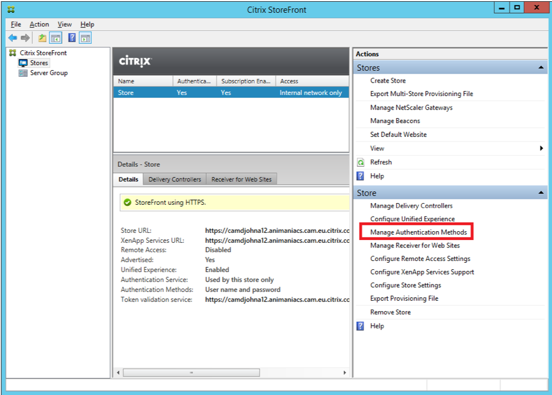
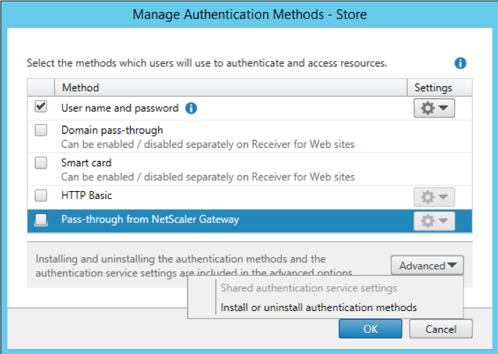
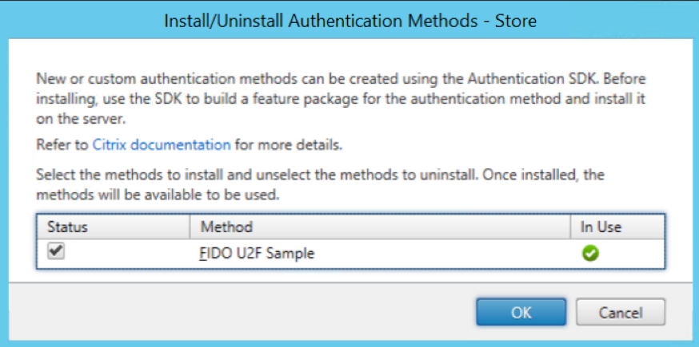
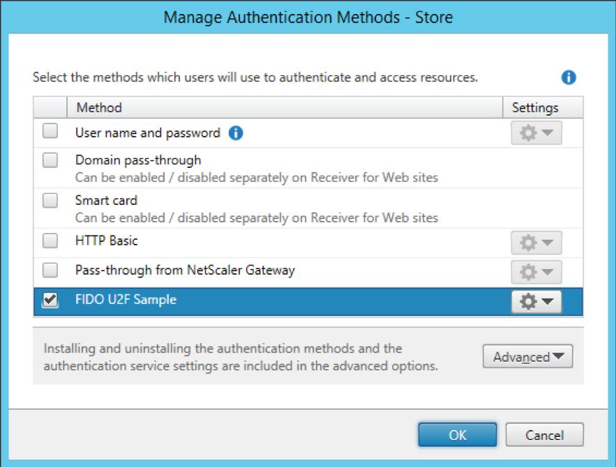

#Sample: FIDO Universal Second Factor

## Overview

### Introduction
This sample for the StoreFront Authentication SDK demonstrates how to create and add a custom form implementation to StoreFront. As described in the StoreFront Services Authentication SDK document, this protocol will be advertised to the clients as: CustomForms. The clients are required to recognize this protocol identifier and map it to their existing Common Forms rendering. Clients will give preference to this new protocol over the existing ExplicitForms protocol, should both be available.

**Note**: Only one authentication method can be deployed that advertises itself with a specific protocol choice name. As Forms customizations rely on being advertised as CustomForms, this means that only one Forms customization can be installed on a StoreFront server.

#### FIDO: Universal Second Factor

The mission of the Fast IDentity Online [(FIDO) Alliance](https://fidoalliance.org/) is to change the nature of online authentication, improving the usability and security. The Universal Second Factor, U2F, specification describes a user carrying a U2F device with built-in support in web browsers. The experience allows online services to augment the security of their existing password infrastructure by adding a strong second factor to user login. The user logs in with a username and password as before. The service can also prompt the user to present a second factor device at any time it chooses.

At time of writing, the Google Chrome browser has built-in support for the FIDO JavaScript API described here: <https://fidoalliance.org/specs/fido-u2f-v1.0-nfc-bt-amendment-20150514/fido-u2f-javascript-api.html> and utilized by this sample.

**Note**: The Google support requires that the web site being accessed, is done so with both an https and fully qualified domain name in the URL.

### User Experience

The U2F sample is a simple implementation of the Forms Protocol that provides the user with an opportunity to register their FIDO device, and then use it to gain access to StoreFront.

The sample has an API for storing registration data, but the sample itself just uses the web application state as the storage mechanism. This means that the registrations are deleted when the web application restarts. This sample needs to be extended with a storage mechanism suitable for your needs, such as; a SQL database, cloud storage, etc.

This sample also demonstrates how to add new credential and label types, as described in the Citrix Common Authentication Forms Language v3.5 document, and how to use the Receiver for Web JavaScript API to auto-post credentials as described in the StoreFront Authentication SDK JavaScript API document.

The following shows how the sequence of forms is displayed in Receiver for Web: 

First, the user is prompted for their username and password.


If the configuration has been updated to allow the user to change their expired password, and the user’s password has expired, then the change password mini-conversation begins.

When the user has successfully entered their credentials, and they have not previously registered a device, then they will be prompted to register a token.


At this point the user “activates” their FIDO U2F token, the details of which are specific to the token, but can involve inserting the token, or pressing a button on the token.

Once a token has been registered, the following page is displayed.

**Note**: If a token has been registered earlier, then the registration page will be skipped and the following will be shown immediately after the user has successfully entered their credentials:


The user again “activates” their FIDO U2F token and they are granted access to their resources.

### Administrator Experience

If the FIDO U2F sample is installed after a store has been created it will not automatically appear in the list of authentication methods for a store, when the “Manage Authentication Methods” action is selected.

However, if the U2F sample is installed before a Store is created, then it will automatically appear with the other authentication methods. In this case, the Receiver for Web plug-in must still be installed for every Receiver for Web site.



Selecting “Install or uninstall authentication methods” from the Advanced options, allows the newly installed U2F authentication sample to be deployed, by selecting the “Status” checkbox.





Once the U2F sample has been deployed, it can then be managed using the same “Manage Authentication Methods” action as for the other authentication methods.



To remove the authentication customization, prior to uninstalling it, again use the “Install or uninstall authentication methods” from the Advanced options of the “Manage Authentication Methods” dialog. Unchecking the “Status” checkbox will remove the authentication method.

#### PowerShell

The feature can also be managed through PowerShell, after first adding all the StoreFront PowerShell modules:

```powershell
Get-Module "Citrix.StoreFront.*" -ListAvailable | Import-Module
```
First the U2F StoreFront authentication customization feature must be added:

```powershell
Install-STFFeature -PackageName " U2FAuthentication"
```
The Authentication Service to which the Feature will be added must then be found. This can be done either from the associated store, in this example, the store is named: “Store”, and is located at virtual path: /Citrix/Store:

```powershell
$store = Get-STFStoreService -VirtualPath "/Citrix/Store"
# Get the Authentication Service from the associated Store 
$authService = Get-STFAuthenticationService -StoreService $store
```

Or by the virtual path of the Authentication Service, in this case: /Citrix/StoreAuth:

```powershell
$authService = Get-STFAuthenticationService -VirtualPath "/Citrix/StoreAuth"
```
Once the Authentication Service has been located, then the feature must be added, using the associated name of the protocol choice, which in this case is: “CustomForms”:

```powershell
Add-STFAuthenticationServiceProtocol -Name "CustomForms" -AuthenticationService 
$authService
```
The following will ensure that the U2F authentication method is enabled:

```powershell
Enable-STFAuthenticationServiceProtocol -AuthenticationService $authService -Name "CustomForms"
```

The U2F authentication feature can be removed from an Authentication Service with the following command:

```powershell
Remove-STFAuthenticationServiceProtocol -Name "CustomForms" -AuthenticationService $authService
```

####Receiver for Web JavaScript Plug-in

The administrator can manage the Receiver for Web JavaScript plug-in using PowerShell only.
Assuming that the StoreFront modules have been loaded, as shown above, then the Receiver for Web plug-in feature must be first added:

```powershell
Install-STFFeature -PackageName "U2FReceiverPlugin"
```

The Receiver for Web site to which the Feature will be added must then be found. This can be done for a specific Receiver for Web site, if its virtual path is known, in this example: /Citrix/StoreWeb

```powershell
$wrSite = Get-STFWebReceiverService -VirtualPath /Citrix/StoreWeb
```

Alternatively, all the Receiver for Web sites for a specified Store can be found, in this example the store is named: “Store” and is located at virtual path /Citrix/Store:

```powershell
$StoreVirtualPath = "/Citrix/Store"
$store = Get-STFStoreService -VirtualPath "/Citrix/Store"

# Get the Receiver for Web sites from the associated Store [array]$wrSites = Get-STFWebReceiverService -StoreService $store
```

Once a Receiver for Web site has been located, the plug-in can be added:

```powershell
Add-STFWebReceiverFeature -Name "U2FReceiverPlugin" -WebReceiverService $wrSite
```

The plug-in can be removed again:

```powershell
Remove-STFWebReceiverFeature –Name "U2FReceiverPlugin" –WebReceiverService $wrSite
```

**Note**: The msi installer will automatically remove the plug-in from every site where it has been deployed when the msi is uninstalled.

**Note**: If the Receiver for Web JavaScript plug-in is not installed, then the following will be displayed when a user attempts to login


###Installer

In common with the other samples, a pre-built installer is provided in addition to the source code.

Before attempting to deploy the pre-built sample installers, it is required to add the certificate at AuthSDK.zip/Certificates/YourCompany.cer to the Third-Party Root Certification Authorities store of the Local Computer account where StoreFront is installed. This is not required for the development machine. If this step is not completed, then the StoreFront Administration Console will display an error because the digital signature of the PowerShell modules associated with this customization will fail 
to verify.

The installer verifies that there is not an existing customization that implements CustomForms, before deploying the StoreFront Feature package and the add-ins to the administration console. To actually deploy and enable a sample the “Manage Authentication Methods” action from the “Stores” node of the StoreFront Administration Console should be used, as described above.

**Note**: If the installer is being deployed to a StoreFront Server Group, it must be run on all servers in the group.

Before attempting to uninstall a sample, the associated authentication method must first be removed using the “Manage Authentication Methods” action from the “Stores” node of the StoreFront Administration Console, as described above. If this is not done, attempting to uninstall will result in a dialog informing the administrator that the feature should be removed using the StoreFront Administration Console first. The sample can then be removed by using the standard “Add/Remove Programs” control panel applet.

The installer also demonstrates automatically removing the Receiver for Web plug-in from every site where it has been deployed.

##Code Sample

###Visual Studio Solution Layout

This sample demonstrates a subset of the available aspects of the SDK, and is composed of nine projects:

* Feature contains the code that will be added to the Authentication Service to control the authentication process, including:
	* The start-up module used to populate the IoC container with objects including the U2F server 
* Forms contains the forms processing code, including:
	* A custom conversation object and its associated factory
	* Custom forms and templates for the individual forms
* Console.Extension contains the code for the administration console, including the data models, action handlers, business logic, and user interface elements.
* Installer is a WiX project to create an msi installer to deploy and remove the U2F Features. It also contains the StoreFront
Feature Package definition and builds the Feature Package.
* Installer.CustomActions contains the msi custom actions required to deploy and remove the U2F Features.
* UnitTests contains some unit tests to verify the merging of the code and configuration into the authentication service,
verify the behavior of the Service Locator, and verify the behavior of the authentication conversation.
* U2F.Interfaces: This contains the standard U2F request generation and response handling and interfaces for the
supporting services, such as: key storage and cryptography.
* DemoServices: This contains the support services required for the demo, such as key storage and attestation certificate
verification. It is these services that customers should re-implement in a manner that suits their environment.
* U2FServer: This brings together the support services and U2F processing into an object providing the required U2F
functionality used by the forms

This sample does not require any configuration, and so does not contain a configuration project or a StoreFront Administration Console View Extension. It also requires no custom deployment steps or PowerShell commands and so does not have a Feature Installer project.

All the projects target the .NET Framework 4.5 and the MSIL platform, unless specifically stated. Projects that target .NET Framework 3.5 are either part of the StoreFront Administration Console, or loaded by the Console. The rationale behind this is discussed in the StoreFront Services Authentication SDK document.

In addition, the sample contains the code for the Receiver for Web JavaScript plug-in, which can be found in the Receiver directory. This contains a featureTemplate directory that holds the files for adding the plugin registration data into Receiver for Web. The Plugin directory contains the JavaScript and css files required by the plugin.

###Feature Project

The project contains the start-up module that is responsible for populating the IoC container. This start-up module adds the conversation factory.

###Forms Project

This C# class library project contains the custom classes for controlling the forms conversation; see the StoreFront Authentication Form Generation document for more details. These classes include:

* The custom conversation and its associated factory
* Custom forms and templates for the individual forms that comprise the conversation

###Console.Extension Project

This C# class library project contains:

* The authentication extension class to provide status messages including one that states that this customization will take precedence over user name and password
* The localizer class to provide the localized authentication method name in the StoreFront Administration Console

**Note**: This project is targeted at .NET Framework 3.5, because it will be loaded by the StoreFront Administration Console.

###Installer Project

This WiX project is responsible for the following:

* Creating the U2F StoreFront Feature Packages
* Creating an installer to:
	* Deploy the Feature Package
	* Deploy the StoreFront Administration Console extension
	* Update the registry so that the StoreFront Administration Console will load the extension

**Note**: This project is targeted at the x64 platform.

###Installer.CustomActions Project

This C# class library project uses the standard pattern, as described in the StoreFront Authentication SDK document, with the Feature identifier and Authentication Protocol Name set to appropriate values for this customization.

**Notes**:

* This project is targeted at .NET Framework 3.5.
* This project is targeted at the x64 platform to ensure that it has access to the correct registry locations. 

###U2F.Interfaces

This project defines the low level U2F structures, such as: the U2F protocol, the request and response messages. In addition, it defines interfaces for services that should be implemented, such as: the cryptography implementation, the registration storage and the certificate trust determination.

###Demo Services

This project contains implementations of the services, such as: a registration storage, and a certificate trust determination mechanism that are suitable for this demo sample.

###U2FServer

This project contains U2FServer object that offers high-level services to the Forms to create registration and authentication messages and handle the responses.

###Unit Tests Project

This project contains standard web.config merge and unmerge, route, and protocol choice tests, in addition to tests of the entire conversation including cancel and error cases.

